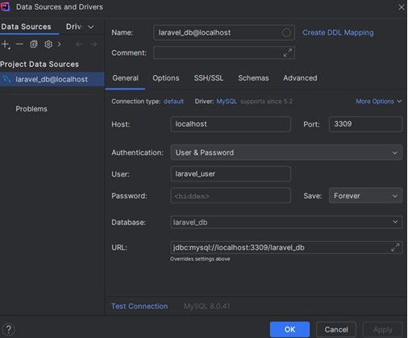

# 📘 About CodeSnippets

**CodeSnippets** is a Laravel-based web application designed to help users efficiently manage, organize, and search Python Code Snippets for ML/NN/NLP projects. It was developed as part of a master's thesis to address the common problem of scattered and poorly organized reusable code in machine learning and natural language processing projects.

The platform supports multilingual functionality (Slovak and English), categorizes Code Snippets according to the CRISP-DM methodology and Snippet categories, and distinguishes between user roles such as guests, registered users, and administrators.

### 🔍 Key Use Cases:
- Quickly reuse Code Snippet in data science projects.
- Store and categorize Code Snippets by phase (e.g., Data Preparation, Modeling, Evaluation).
- Share reusable solutions within a development team or classroom environment.
- Support for teaching, learning, and development with clean, categorized code examples.

---

# 🛠️ Instructions for Cloning and Installing the CodeSnippets Project

This guide describes the process of cloning, configuring, and running the **CodeSnippets** application, developed as part of a master's thesis project. 

---

## 🔧 Installation Steps

### 1. Clone the Repository

```bash
git clone https://github.com/korni0102/CodeSnippets.git
cd CodeSnippets
```

---

### 2. Install PHP Dependencies Using Composer

```bash
composer install
```

---

### 3. Create Environment Configuration File and Generate App Key

```bash
cp .env.example .env
php artisan key:generate
```

---

### 4. Configure Database Connection

Edit the `.env` file and set the following values based on your local database setup:

```env
DB_CONNECTION=mysql
DB_HOST=localhost
DB_PORT=3309
DB_DATABASE=laravel_db
DB_USERNAME=laravel_user
DB_PASSWORD=secret
```

---

### 5. Start Docker Environment

Make sure Docker Desktop is running. Then initialize the containers with:

```bash
docker-compose -f docker/docker-compose.yml up -d
```

---

### 6. Connect PhpStorm to the Database

To allow full integration with PhpStorm, configure the MySQL connection under:  
**File > Data Sources and Drivers**

---

### 7. Run Migrations and Seed the Database

This command will create the required database tables and populate them with test data including an admin user and default snippets.

```bash
php artisan migrate
php artisan db:seed
```

---

### 8. Start the Local Development Server

```bash
php artisan serve
```

The application will now be accessible at:  
👉 `http://127.0.0.1:8000/`

---
